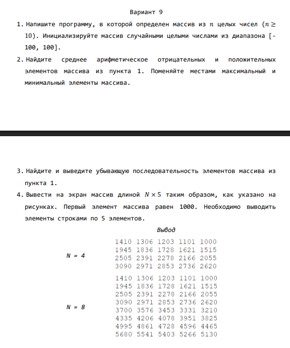

# Описание задания №2 "Вычисления в одномерных массивах"

`ranlux48_base` — это один из алгоритмов генерации псевдослучайных чисел, реализованный в стандартной библиотеке `C++` и доступный в `Python` через модуль `random`

Он относится к семейству `Luxembourg LCG` (`Linear Congruential Generator`) с улучшенными характеристиками.

`1. Что это такое?`

**Основа алгоритма:** Модифицированный линейный конгруэнтный генератор (`LCG`), оптимизированный для устранения корреляций между последовательными числами.

**Качество чисел:** Обеспечивает высокую статистическую случайность, подходит для задач, требующих надежных случайных данных (например, криптография, симуляции).

**Скорость:** Медленнее, чем базовые `LCG`, из-за дополнительных операций для улучшения качества.

`2. Отличия от Mersenne Twister`

-------------------------------------------------------------------------
| **Характеристика**       | `ranlux48_base` | `Mersenne Twister (MT19937)` |
| **Скорость**             | Медленнее       | Быстрее                      |
| **Качество случайности** | Выше            | Достаточно высокое           |
| **Период повторения**    | ~10¹⁷¹          | ~10⁶⁰⁰⁰                      |
| **Применение**           | Научные расчеты | Общие задачи                 |
-------------------------------------------------------------------------

--

